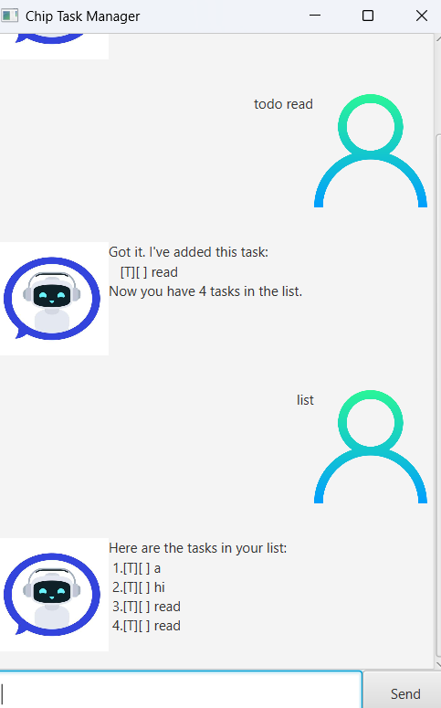

# Chip User Guide



## Introduction

Chip is a friendly task management application that helps you organize your daily tasks efficiently. Whether you need to track simple todos, manage deadlines, or schedule events, Chip provides an intuitive interface to keep you organized and productive.

## Quick Start

1. **Launch Chip**: Run the application using `./gradlew run`
2. **Add your first task**: Type `todo read a book` to create a simple task
3. **View your tasks**: Type `list` to see all your tasks
4. **Mark tasks as done**: Type `mark 1` to mark the first task as completed
5. **Get help**: Type `help` to see all available commands

## Features

### 1. Adding Tasks

#### Adding a Todo
Creates a simple task without any time constraints.

**Format**: `todo <description>`

**Example**: `todo read a book`

**Expected outcome**:
```
Got it. I've added this task:
  [ ] read a book
Now you have 1 task in the list.
```

#### Adding a Deadline
Creates a task with a specific deadline.

**Format**: `deadline <description> /by <date>`

**Example**: `deadline submit report /by 2024-12-31 1800`

**Expected outcome**:
```
Got it. I've added this task:
  [ ] submit report (by: Dec 31 2024 6:00 PM)
Now you have 2 tasks in the list.
```

#### Adding an Event
Creates an event with start and end times.

**Format**: `event <description> /from <start> /to <end>`

**Example**: `event team meeting /from 2024-12-25 1400 /to 2024-12-25 1600`

**Expected outcome**:
```
Got it. I've added this task:
  [ ] team meeting (from: Dec 25 2024 2:00 PM to: Dec 25 2024 4:00 PM)
Now you have 3 tasks in the list.
```

### 2. Managing Tasks

#### Viewing All Tasks
Displays all tasks in your list with their current status.

**Format**: `list`

**Expected outcome**:
```
Here are the tasks in your list:
1. [ ] read a book
2. [ ] submit report (by: Dec 31 2024 6:00 PM)
3. [ ] team meeting (from: Dec 25 2024 2:00 PM to: Dec 25 2024 4:00 PM)
```

#### Marking Tasks as Done
Marks a specific task as completed.

**Format**: `mark <task number>`

**Example**: `mark 1`

**Expected outcome**:
```
Nice! I've marked this task as done:
  [X] read a book
```

#### Marking Tasks as Not Done
Marks a completed task as not done.

**Format**: `unmark <task number>`

**Example**: `unmark 1`

**Expected outcome**:
```
OK, I've marked this task as not done yet:
  [ ] read a book
```

#### Deleting Tasks
Removes a task from your list permanently.

**Format**: `delete <task number>`

**Example**: `delete 2`

**Expected outcome**:
```
Noted. I've removed this task:
  [ ] submit report (by: Dec 31 2024 6:00 PM)
Now you have 2 tasks in the list.
```

### 3. Finding and Organizing Tasks

#### Finding Tasks
Searches for tasks containing specific keywords.

**Format**: `find <keyword>`

**Example**: `find meeting`

**Expected outcome**:
```
Here are the matching tasks in your list:
1. [ ] team meeting (from: Dec 25 2024 2:00 PM to: Dec 25 2024 4:00 PM)
```

#### Sorting Tasks
Sorts all tasks alphabetically by description.

**Format**: `sort`

**Expected outcome**:
```
Tasks have been sorted alphabetically by description.
```

### 4. Getting Help

#### Help Command
Displays all available commands and their usage.

**Format**: `help`

**Expected outcome**:
```
Here are the commands I understand:
 todo <description> - Add a simple task
 deadline <description> /by <date> - Add a task with deadline
 event <description> /from <start> /to <end> - Add an event
 list - Show all tasks
 mark <number> - Mark task as done
 unmark <number> - Mark task as not done
 delete <number> - Remove a task
 find <keyword> - Search for tasks
 sort - Sort tasks alphabetically
 help - Show this help message
 bye - Exit the application
```

### 5. Exiting the Application

#### Goodbye Command
Saves your tasks and exits the application.

**Format**: `bye`

**Expected outcome**:
```
Bye. Hope to see you again soon!
```

## Data Storage

Chip automatically saves your tasks to a file (`data/chip.txt`) so your tasks persist between sessions. You don't need to manually save your work - Chip handles this automatically.

## Tips for Effective Use

1. **Use descriptive task names**: Clear descriptions help you understand what needs to be done
2. **Set realistic deadlines**: Use the deadline feature for time-sensitive tasks
3. **Break down large tasks**: Create multiple smaller todos instead of one large task
4. **Use the find feature**: When you have many tasks, use `find` to quickly locate specific items
5. **Mark tasks as done**: Regularly mark completed tasks to keep your list current
6. **Sort when needed**: Use the sort feature to organize tasks alphabetically

## Troubleshooting

### Common Issues

**Issue**: "I don't understand that command"
**Solution**: Type `help` to see all available commands

**Issue**: "Task number must be positive"
**Solution**: Use a valid task number (1, 2, 3, etc.) when marking or deleting tasks

**Issue**: "The description of a todo cannot be empty"
**Solution**: Provide a description after the `todo` command

**Issue**: "Please specify the deadline time using /by"
**Solution**: Use the format `deadline <description> /by <date>` for deadline tasks

### Date and Time Formats

Chip accepts various date and time formats:
- **Date**: `2024-12-31`, `Dec 31 2024`, `31/12/2024`
- **Time**: `1800`, `6:00 PM`, `18:00`
- **Combined**: `2024-12-31 1800`, `Dec 31 2024 6:00 PM`

## Support

If you encounter any issues or have questions about using Chip, please refer to the help command (`help`) for a list of available commands and their usage.

---

*Chip - Your friendly task management companion!*